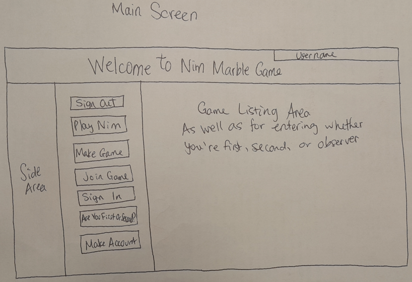
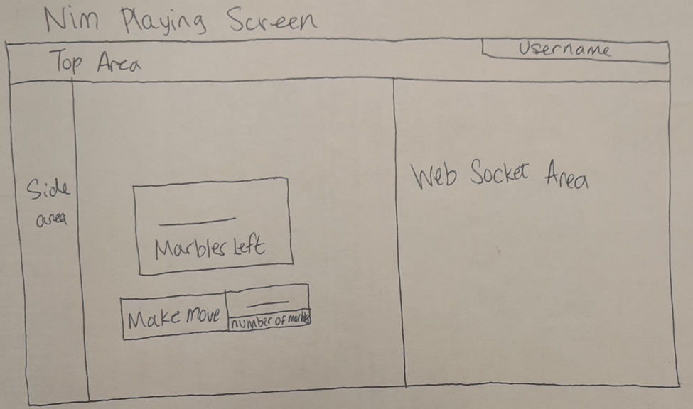
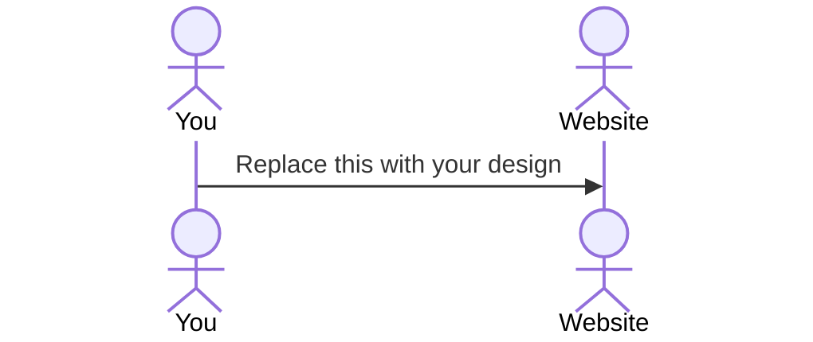

# Nim Marble Game Website

[My Notes](notes.md)

This application will be an application for a Nim game of taking marbles from a pile.

> [!NOTE]
>  This is a template for your startup application. You must modify this `README.md` file for each phase of your development. You only need to fill in the section for each deliverable when that deliverable is submitted in Canvas. Without completing the section for a deliverable, the TA will not know what to look for when grading your submission. Feel free to add additional information to each deliverable description, but make sure you at least have the list of rubric items and a description of what you did for each item.

> [!NOTE]
>  If you are not familiar with Markdown then you should review the [documentation](https://docs.github.com/en/get-started/writing-on-github/getting-started-with-writing-and-formatting-on-github/basic-writing-and-formatting-syntax) before continuing.

## 🚀 Specification Deliverable

> [!NOTE]
>  Fill in this sections as the submission artifact for this deliverable. You can refer to this [example](https://github.com/webprogramming260/startup-example/blob/main/README.md) for inspiration.

For this deliverable I did the following. I checked the box `[x]` and added a description for things I completed.

- [x] Proper use of Markdown
- [x] A concise and compelling elevator pitch
- [x] Description of key features
- [x] Description of how you will use each technology
- [x] One or more rough sketches of your application. Images must be embedded in this file using Markdown image references.

### Elevator pitch

I'm doing a game called Nim about taking piles of marbles from a pile of marbles that starts with a certain number of marbles, which they can choose. Each game will have two players take turns with each other and take out a certain number of marbles, from 1 up to a number of their choice. Whoever takes the last marble wins.

### Design

Lorem ipsum dolor sit amet, consectetur adipiscing elit, sed do eiusmod tempor incididunt ut labore et dolore magna aliqua. Ut enim ad minim veniam, quis nostrud exercitation ullamco laboris nisi ut aliquip ex ea commodo consequat. Duis aute irure dolor in reprehenderit in voluptate velit esse cillum dolore eu fugiat nulla pariatur. Excepteur sint occaecat cupidatat non proident, sunt in culpa qui officia deserunt mollit anim id est laborum.

### Key features

- Some of the features will be pages that allow people to see what games are available to be joined and join games as observers.
- People will be able to see the list of games and people will be able to make new games.
- The number of marbles will be displayed in a box during the game, rather than showing actual marbles.
- People can start games and other people can join.

### Technologies

I am going to use the required technologies in the following ways.

- **HTML** - Displaying my website, side bars, the person's username and log in screens.
- **CSS** - This will be used to style my website and to display nice colors and to change heights and widths of things.
- **React** - This will be used to notice clicks and to change things inside buttons, and text in other places.
- **Service** - This will be used to write computer functions that can calculate new numbers of marbles, and hash passwords.
- **DB/Login** - This is for making usernames, which can go in the databases, and for checking passwords
- **WebSocket** - This will be used to view the games in real time, and to give notifications such as people joining games, people leaving games, and people making moves in games.

## 🚀 AWS deliverable

For this deliverable I did the following. I checked the box `[x]` and added a description for things I completed.

- [x] **Server deployed and accessible with custom domain name** - [Nim Server](https://cs260nim-game.click).

## 🚀 HTML deliverable

For this deliverable I did the following. I checked the box `[x]` and added a description for things I completed.

- [x] **HTML pages** - I made both of my HTML pages, being the main screen and the screen for game playing.
- [x] **Proper HTML element usage** - I used body, html, header, a href, footer, main, table, p, tr, div, and td tags.
- [x] **Links** - I added links to my GitHub and from the pages to each other.
- [x] **Text** - My HTML pages have text in the p tags.
- [x] **3rd party API placeholder** - I made links to places that explain Nim game.
- [x] **Images** - The main screen has a picture of some marbles and the game playing screen has a picture of some marbles.
- [x] **Login placeholder** - I made a place where someone could sign in, although it doesn't work yet.
- [x] **DB data placeholder** - The database will be used when people try to log in. It will also be used to list all games and when people try to join games.
- [x] **WebSocket placeholder** - The Web Socket Area is at the right of the game playing screen and will be used when someone makes a move or joins or leaves.

## 🚀 CSS deliverable

For this deliverable I did the following. I checked the box `[x]` and added a description for things I completed.

- [x] **Header, footer, and main content body** - I have header, footer, and main for both pages.
- [x] **Navigation elements** - I have nav tags in upper left part of both pages.
- [x] **Responsive to window resizing** - I made it so that window resizing changes the sizes of certain elements.
- [x] **Application elements** - I have socket area and other things.
- [x] **Application text content** - I have text in the parts of my web pages.
- [x] **Application images** - I have images of marbles.

## 🚀 React part 1: Routing deliverable

For this deliverable I did the following. I checked the box `[x]` and added a description for things I completed.

- [x] **Bundled using Vite** - I am using Vite to put the code together in Amazon Web Services.
- [x] **Components** - I have the same navigation bar from each page that navigates to both pages of my website using function calls.
- [x] **Router** - I added BrowserRouter tags to get the website to have no more .html thing at the end.

## 🚀 React part 2: Reactivity deliverable

For this deliverable I did the following. I checked the box `[x]` and added a description for things I completed.

- [ ] **All functionality implemented or mocked out** - I did not complete this part of the deliverable.
- [x] **Hooks** - I hae a hook to make a variable and set it. I used hooks to set the picture variables for being displayed in the main screen, the playing screen, and the error screen.

## 🚀 Service deliverable

For this deliverable I did the following. I checked the box `[x]` and added a description for things I completed.

- [ ] **Node.js/Express HTTP service** - I did not complete this part of the deliverable.
- [ ] **Static middleware for frontend** - I did not complete this part of the deliverable.
- [ ] **Calls to third party endpoints** - I did not complete this part of the deliverable.
- [ ] **Backend service endpoints** - I did not complete this part of the deliverable.
- [ ] **Frontend calls service endpoints** - I did not complete this part of the deliverable.
- [ ] **Supports registration, login, logout, and restricted endpoint** - I did not complete this part of the deliverable.

## 🚀 DB deliverable

For this deliverable I did the following. I checked the box `[x]` and added a description for things I completed.

- [ ] **Stores data in MongoDB** - I did not complete this part of the deliverable.
- [ ] **Stores credentials in MongoDB** - I did not complete this part of the deliverable.

## 🚀 WebSocket deliverable

For this deliverable I did the following. I checked the box `[x]` and added a description for things I completed.

- [ ] **Backend listens for WebSocket connection** - I did not complete this part of the deliverable.
- [ ] **Frontend makes WebSocket connection** - I did not complete this part of the deliverable.
- [ ] **Data sent over WebSocket connection** - I did not complete this part of the deliverable.
- [ ] **WebSocket data displayed** - I did not complete this part of the deliverable.
- [ ] **Application is fully functional** - I did not complete this part of the deliverable.
